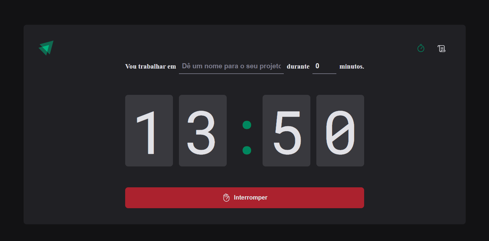
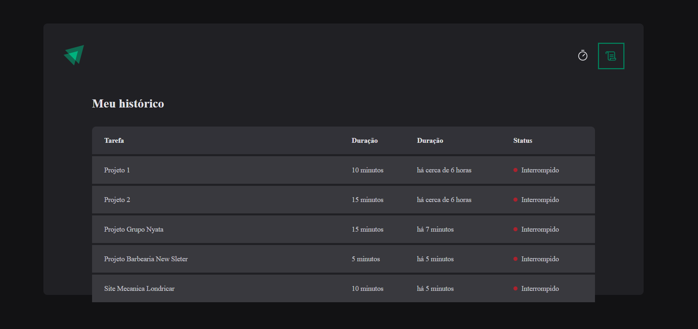

# Projeto Ignite Timer | Rocketseat

Neste projeto, desenvolvi o segundo módulo do curso de React da Rocketseat, O projeto é uma ferramenta para gerenciamento de projetos, com as seguintes funcionalidades de cadastro de Novos Projetos, Controle de Status Listagem de Projetos.
Oferece uma visão geral de todos os projetos registrados, com detalhes sobre o status atual de cada um.
A construção deste módulo não só aprimorou minhas habilidades em React, como também me permitiu aplicar conceitos importantes de gerenciamento de estado e persistência de dados.




### Veja o projeto online

 ✅  https://ignite-timer-react-rocketseat.vercel.app/
### Tecnologias Utilizadas

- React com Vite: ^18.3.1
- Typescript: ^5.2.2

### Funcionalidades

- [x] Cadastro de Novos Projetos: Permite ao usuário adicionar um novo projeto, especificando seu nome e o tempo estimado para seu desenvolvimento.

- [x] Controle de Status: O usuário pode marcar o status de cada projeto, seja ele em execução, concluído ou qualquer outro status definido.
- [x] Listagem de Projetos: Oferece uma visão geral de todos os projetos registrados, com detalhes sobre o status atual de cada um.

- [x] Persistência de Dados: Utiliza o localStorage para armazenar e recuperar os ciclos de desenvolvimento dos projetos, garantindo que os dados sejam mantidos mesmo após o fechamento da aplicação.

- [x] Gravando os cyclos em localStorage;

### Aprendizado

- Styled-components;
- Roteamento com React Autodown';
- Contextos;
- Reducers;
- Immer;
- React Hook Form;
- Validação utilizando o Hook Form Resolvers e Zod;
- Formatação de datas e hora com date-fns;

### 📦 Bibliotecas

⬇️ Permite que você escreva CSS dentro dos seus componentes React usando uma sintaxe de template literals. Em vez de criar arquivos CSS separados ou usar classes CSS tradicionais.

```
npm i styled-components
npm i @types/styled-components -D
```

<br>

⬇️Biblioteca Eslint é uma ferramenta de linting para JavaScript e TypeScript. Ela é usada para identificar e corrigir problemas no código, garantindo a qualidade e a consistência do código-fonte.

```
npm i eslint -D
```

<br>

⬇️utilizada em aplicações React para implementar roteamento, ou seja, para gerenciar a navegação entre diferentes páginas ou seções dentro da aplicação.

```
npm i react-router-dom
```

<br>

Biblioteca de icones para o projeto: https://phosphoricons.com/

```
npm i phosphor-react
```

<br>

⬇️é uma ferramenta popular para gerenciar formulários em aplicações React. Ela facilita a manipulação de formulários, fornecendo uma API simples e eficiente para gerenciar o estado dos campos, validação e submissão.

```
npm i react-hook-form
```

<br>

⬇️uma ferramenta para validação de esquemas em JavaScript e TypeScript. Ela é usada para definir e validar dados com base em esquemas,

```
npm i zod
```

<br>

⬇️Biblioteca para intregar a zod com a Hook form

```
npm i @hookform/resolvers
```

<br>
⬇️Biblioteca para trabalhar com datas e tempo

```
npm i date-fns
```

<br>
⬇️Biblioteca para trabalhar com dados imutavies

```
npm i immer
```

### Comandos

Comando para vasculhar erros do eslint no código

```
npx eslint src --ext .ts, .tsx
```

Comando para corrir todos os erros no eslint automaticamente em todo o projeto.

```
npx eslint src --ext .ts, .tsx --fix
```

### Como Executar o Projeto

1. Clone o repositório:

   ```bash
   https://github.com/DevGabrielrr/IgniteTimer-react-rocketseat.git
   ```

2. Navegue até o diretório do projeto:

   ```bash
   cd nome-do-repositorio
   ```

3. Atualize o projeto, Em seu terminal e na pasta do projeto

   ```bash
   npm install
   ```

4. Rodar o projeto

   ```bash
   npm run dev
   ```
